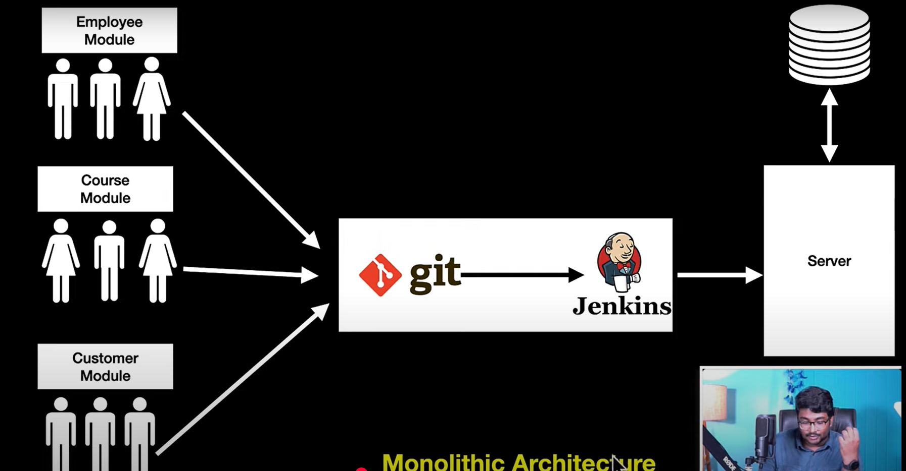
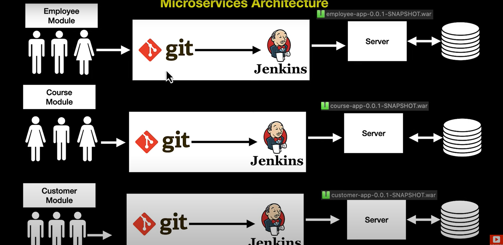

# Microservices

### Module
1. Grouping or Packaging the related the source files into a single unit.

### Monolithic 
1. Wrapping it up all the components into a single zip file and deploying this zip into the server like jboss or tomcat server.

### Problems with this Architecture
1. Requirement: Suppose you've a application called Employee-Customer Management System, and three different sets of groups each working on Employee Module, Course Module and Customer. And then you got an requirement to make changes for course module i.e Add in new features/Fix some bugs. And the team implemented the feature and pushed the code to Git and jenkins takes the code and created build out of it and deployed in the server and the application becomes live.
(In local this is similar to maven creating .war or .jar file with maven install or maven build and deploying this in tomcat server).
2. Let's you test or run regression tests on entire application.
3. After testing you got to know that new feature that has being implemented is working fine but other features that were there and working before are now not working.(Like customer login functionality is not working)
4. Any changes in the code, leads you to test entire application.
5. Developers may not have knowledge of other modules of the application which makes it hard to fix issue because you may not know how this change will affect other module.
6. Not Cost effective.
Ex: You're running an Advertisement with 20% off on the Course and this makes many customers coming into you website and this lets your site much slower and puts loads on the server. Actually you're server is able to handle only 200 concurrent request but now you're getting 1000 requests. For this you again need to implement Load Balancer to route the requests to different server instance which has the same zip or war file on three different servers which costs you more. Eventhough you have load on the customer module you need to deploy the large file of all the modules into the server. So what's cost for you for deploying the code of customer module if it were microservice will be more as you're deploying the entire code.
7. Single database.

### Microservices
1. Building small, small services is called Microservices.
2. Microservices is an approach with which we can develop small, small services.
3. Each service should have it's own server/container/database/process.
4. The services should be light weight and independenly deployable.

### Pros
1. Can have multiple databases.
2. Can independently deploy and scale it up.
3. We can have separate projects each project does a specific thing instead of doing whole thing.
Ex: Course service will only have course related endpoints instead of customer or employee end points.
4. Communication through REST calls.
5. Dev doesn't have to know the entire knowledge of the application.
6. Each app can be tested differently.
7. No need of entire application testing.
8. Scalable. Can increase the server instances only for load increased application.

### Cons
1. Managing of the different databases, servers.
2. In a monolithic application, all services run in one process, allowing function calls and database access to happen in-memory, which is extremely fast.

In microservices, each service is often deployed on different servers, containers, or cloud instances, requiring network communication between them.

3. Multiple distributed DB calls

### Process Involved.
1. Create separate projects.
2. Run as Maven install (Build apps to generate war).
3. Do the refresh on projects.
4. Now take all this individual zip files and put it(deploy it) in separate, separate servers.
5. If you put all in inside a server if that server goes down all microservices will go down. So Every microservice 
should run inside a separate server.
6. As you know your springboot will have embedded tomcat server your code gets deployed automatically in tomcat server when you run your springboot app.
7. Check boot springboot dasboard you'll be able to see different apps and run as application.
8. Now your services are deployed in 4 different tomcat containers (If you've 4 different projects)
9. Each will have different database. Ex: Employee database, Course database.

### Why Springboot is used for microservices development.
1. Autoconfiguration feature
2. Spring comes with production ready load balancer feature.
3. Loose coupling.
4. Managed dependencies. (With started projects)

### How to talk b/w two microservices
#### Options
1. Feign client
2. Rest template (From Spring 6.x this will deprecated better to use other two REST ways)
3. Web client

### Challenges in Microservices
1. Changing the common across services.
Ex: Change property name of com.name = Mahender in application.properties. For this you need to go each individual microservice and change which is a big task.
2. Dependency on one service some the service you are trying to reach is down.
Ex: Employee service making request to Address Service but this service is either down or slow.
3. Routing multiple requests of a service becomes a challenge with Load balancer.

#### Note
Note: All this problems can be solved using Spring Cloud.

#### Reference
[Refer Spring Cloud here!](https://spring.io/projects/spring-cloud)

### Spring Cloud
Provides some common tools and techniques to quickly develop common pattern of microservice.